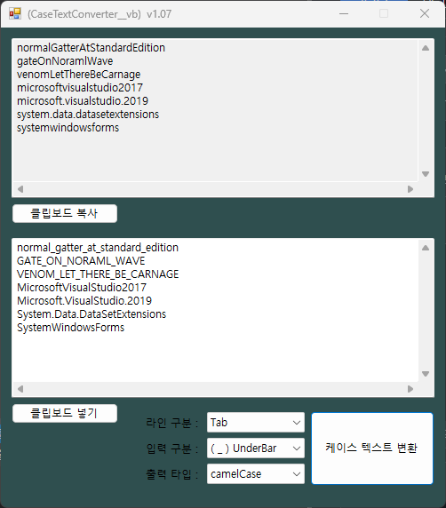

-----------------------------------------------------------------------------------------------------------------------
CaseTextConverter는
VB.NET으로 작성된 간단한 케이스텍스트 변환 도구입니다.

변수명 또는 함수명 단위로
SNAKE_CASE
snake_case
PascalCase
camelCase

변환을 도와줍니다.

1) "라인 구분"을 선택하여 전체데이터에서 케이스단위 나누기 기준을 지정합니다.
2) "입력 구분"을 선택하여 단어 나누기 기준을 지정하세요. (Empty로 설정하면 대분자 기준)
3) "출력 타"을 선택하여 변환될 텍스트를 설정합니다.
4) 그리고 텍스트 변환 클릭

-----------------------------------------------------------------------------------------------------------------------
CaseTextConverter
It is a simple text conversion tool written in VB.NET.

By variable name or function name
SNAKE_CASE
snake_case
PascalCase
camelCase

Helps with conversion.

